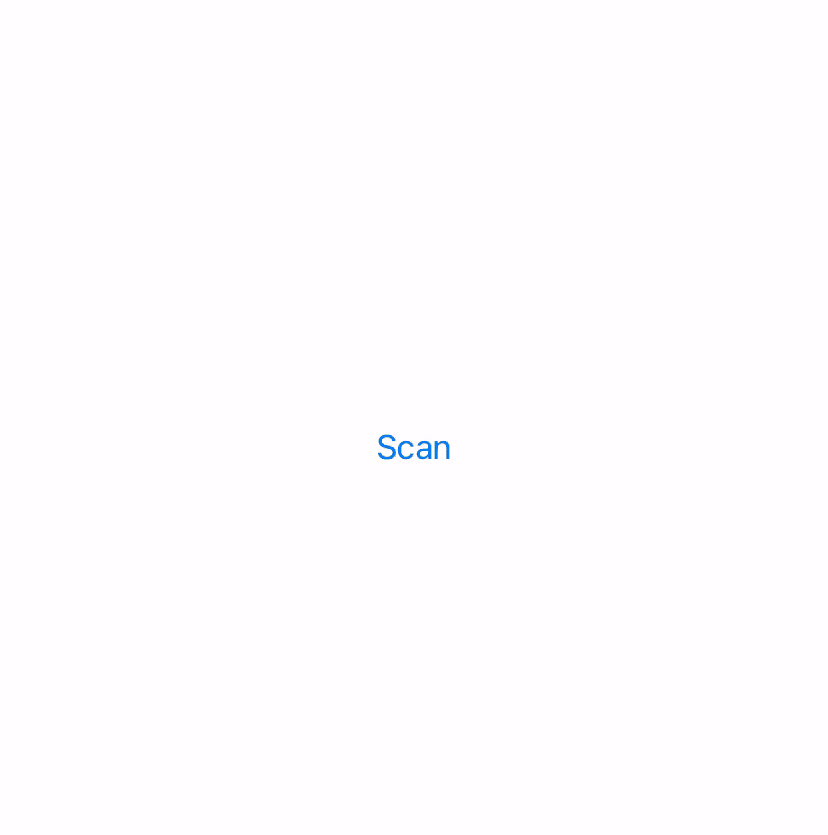

# BarcodeScanner

This is a sample app that scan barcode and generate a digital copy of it

Library used for scanning barcode:

https://github.com/twostraws/CodeScanner

Library used for barcode generation:

https://github.com/TheLevelUp/ZXingObjC

